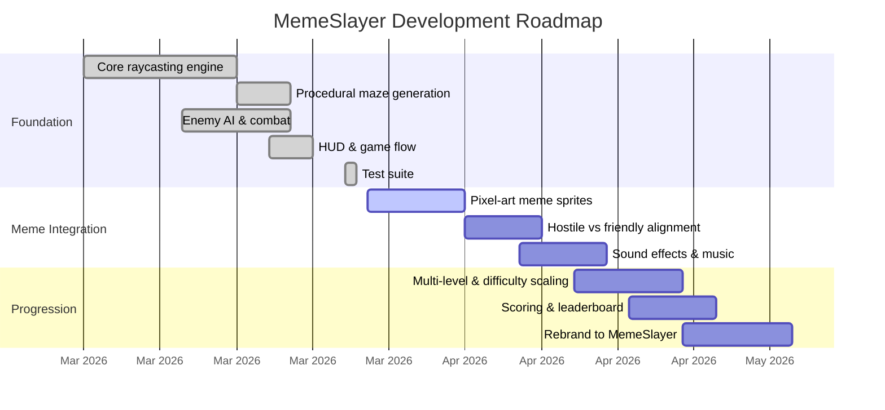

# MemeSlayer

Retro first-person shooter built with Flutter + Flame for macOS. DDA raycasting engine (Wolfenstein 3D style) with procedural maze generation, enemy AI, and a path toward meme-themed chaos.

## Quick Start

```sh
flutter run -d macos
```

## Controls

| Key | Action |
|-----|--------|
| WASD | Move/strafe |
| Arrow keys | Turn/move |
| Q / E | Snap turn 90° |
| Space / Click | Shoot |
| Shift | Sprint |
| M | Toggle minimap |
| ESC | Menu |

## Roadmap



### Phase Breakdown

**Phase 1 — Foundation** (Done)
- DDA raycasting with textured walls and fog
- Procedural maze generation (recursive backtracker + room carving)
- 4 enemy types with state-machine AI (grunt, imp, brute, sentinel)
- Line-of-sight detection, hitscan combat, pickups
- Win/lose conditions, HUD, main menu, endgame stats
- 33 unit tests covering core systems

**Phase 2 — Meme Integration** (Next)
- Issue #3: Replace geometric enemies with pixel-art meme sprites
- Issue #4: Friendly vs hostile NPCs (some memes help, some attack)
- Issue #5: Sound effects and background music

**Phase 3 — Progression**
- Issue #6: Multi-level progression with scaling difficulty
- Scoring system with meme-specific point values
- Issue #7: Full rebrand — MemeSlayer identity, splash screen, polish

## Architecture

```
lib/
├── main.dart              # App entry, GameWidget + Listener for input
├── game/fps_game.dart     # FlameGame — game loop, state, rendering
├── engine/
│   ├── raycaster.dart     # DDA raycasting algorithm
│   ├── renderer.dart      # Canvas rendering (walls, enemies, minimap)
│   └── textures.dart      # Procedural texture generation
├── entities/
│   ├── player.dart        # Movement, collision, shooting
│   └── enemy.dart         # AI state machine (idle/chase/attack/dead)
├── world/
│   ├── game_map.dart      # 2D tile grid, spawn points
│   └── maze_generator.dart # Recursive backtracker maze gen
└── ui/
    ├── hud_overlay.dart
    ├── main_menu_overlay.dart
    └── endgame_overlay.dart
```

## Development

```sh
flutter analyze    # Lint
flutter test       # Run tests
flutter run -d macos
```
