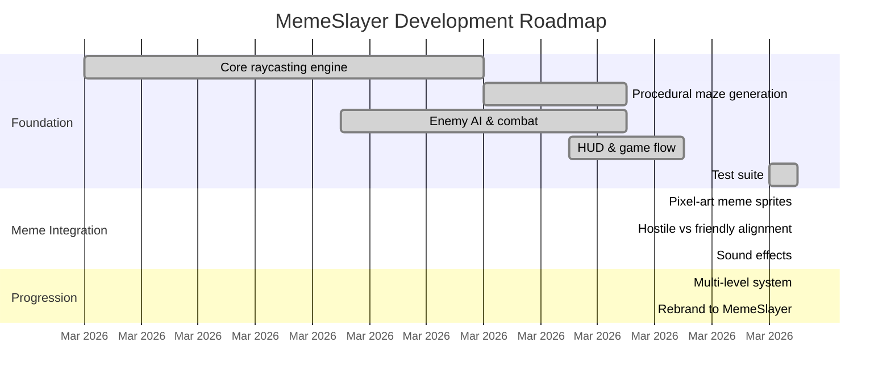

# MemeSlayer

> *Not everything in the maze deserves to die.*

A retro first-person shooter built with Flutter + Flame for macOS. Wolfenstein 3D-style raycasting engine with procedural maze generation, meme-themed enemies, and a moral dilemma: shoot everything, or spare the friendlies?

## Quick Start

```sh
flutter run -d macos
```

## Controls

| Key | Action |
|-----|--------|
| WASD | Move/strafe |
| Arrow keys | Turn/move |
| Q / E | Snap turn 90° |
| Space / Click | Shoot |
| Shift | Sprint |
| Trackpad | Look around |
| M | Toggle minimap |
| ESC | Menu |

## The Meme Roster

| Meme | Type | Behavior |
|------|------|----------|
| **Trollface** | Grunt | Medium speed, gets in your face |
| **Doge** | Imp | Fast and chaotic, much speed |
| **Grumpy Cat** | Brute | Slow but tanky, hits hard |
| **Stonks Man** | Sentinel | Keeps distance, shoots from afar |

NPCs come in three alignments:
- **Hostile** (red glow) — Kill for points
- **Friendly** (green glow) — Kill and lose 200 points
- **Neutral** (gold glow) — Approach for free items

## Features

- **DDA Raycasting** — Wolfenstein 3D-style pseudo-3D rendering
- **Procedural Everything** — Mazes, textures, sprites, and sounds all generated at runtime
- **Pixel-Art Meme Sprites** — 64x64 faces with idle/hurt/dead frames
- **Progressive Difficulty** — Bigger mazes, more enemies, new types each level
- **Moral Scoring** — Heavy penalty for killing friendlies, innocence bonus for restraint
- **Synthesized Audio** — Retro sound effects generated from sine waves and noise
- **3 Lives System** — Health carries over between levels

## Roadmap



## Architecture

```
lib/
├── main.dart                  # App entry, GameWidget + Listener for input
├── game/fps_game.dart         # FlameGame — game loop, state, level progression
├── engine/
│   ├── raycaster.dart         # DDA raycasting algorithm
│   ├── renderer.dart          # Canvas rendering (walls, enemies, minimap)
│   ├── textures.dart          # Procedural wall texture generation
│   ├── sprites.dart           # Procedural pixel-art meme sprites
│   └── audio.dart             # Synthesized retro sound effects
├── entities/
│   ├── player.dart            # Movement, collision, shooting
│   └── enemy.dart             # AI state machine with alignment system
├── world/
│   ├── game_map.dart          # 2D tile grid, spawn points
│   └── maze_generator.dart    # Recursive backtracker maze generation
└── ui/
    ├── hud_overlay.dart       # Health, ammo, score, level, lives
    ├── main_menu_overlay.dart # MemeSlayer title screen
    ├── level_splash_overlay.dart # Between-level transition
    └── endgame_overlay.dart   # Win/lose/game over stats
```

## Development

```sh
flutter analyze    # Lint (0 issues)
flutter test       # 38 tests
flutter run -d macos
```

## Tech Stack

- **Flutter** — UI framework and Canvas API
- **Flame** — Game loop and keyboard input
- **audioplayers** — WAV playback from synthesized bytes
- **Zero external assets** — Everything procedurally generated
